<div align="center">

<!-- Animated Wind Farm Header -->


<br/>

<!-- Typing Animation -->
[](https://git.io/typing-svg)

<br/>

<!-- Dynamic Research Focus -->
[;Actuator+Line+Method+(ALM);Wind+Turbine+Wake+Dynamics;Atmospheric+Turbulence+Modeling;High-Fidelity+CFD+Simulations)](https://git.io/typing-svg)

<br/>

<!-- Social Badges -->
[](https://www.linkedin.com/in/abdelmalek-bouaziz/)
[](mailto:Abdelmalek.BOUAZIZ@um6p.ma)
[](https://github.com/abdelmalekbouaziz)

</div>

---


##  About Me

I'm **Malik**, a PhD researcher passionate about unraveling the complex physics of wind farm turbulence through high-fidelity computational simulations.

🌬️ **Research Focus:** Large Eddy Simulation with Actuator Line Method (LES-ALM) for wind turbine wake dynamics and aerodynamic performance analysis

🔬 **Current Work:** Investigating how turbulent length scales and wind shear affect wake interactions in tandem wind turbine configurations using the NREL 5MW reference turbine

🎯 **Mission:** Advancing our understanding of atmospheric boundary layer flows to optimize wind farm efficiency and reduce fatigue loads

⚡ **Fun Fact:** I write codes on my notebook before typing them!

<br clear="right"/>

---

## 🔬 Research Interests

<div align="center">

`Turbulence Modeling` · `Wind Energy CFD` · `Large-Eddy Simulation` · `Wake Dynamics`

`Actuator Line Method` · `Atmospheric Boundary Layers` · `HPC Simulations` · `Mann Turbulence Model`

</div>

---

## 🛠️ Technical Arsenal

<div align="center">

### Languages


### CFD & Simulation


### Visualization & Post-Processing


### Scientific Computing & HPC


### Data & Analysis


</div>

---

## 📊 GitHub Analytics

<div align="center">
  
  
</div>

<div align="center">
  
</div>

---

## 🌊 Current Research

<div align="center">

```
┌─────────────────────────────────────────────────────────────────────────────┐
│                     WIND TURBINE WAKE DYNAMICS STUDY                        │
├─────────────────────────────────────────────────────────────────────────────┤
│                                                                             │
│    ╭──────╮         ╭──────╮                                                │
│    │ ═══╪═│  ───►   │ ═══╪═│   ───►   Wake Recovery Analysis               │
│    │   │  │  5D     │   │  │                                                │
│    ╰───┴──╯         ╰───┴──╯          • Turbulent Length Scales: 0.1-120m  │
│   Upstream        Downstream          • Wind Shear Coefficients: 4 levels  │
│   Turbine          Turbine            • 16 Parametric Cases (4×4 Design)   │
│                                       • NREL 5MW Reference Turbine          │
│                                                                             │
│   Method: LES-ALM  │  Turbulence: Mann Model  │  Platform: OpenFOAM/HPC   │
└─────────────────────────────────────────────────────────────────────────────┘
```

</div>

---

## 🤝 Let's Collaborate!

<div align="center">

I'm always excited to connect with fellow researchers and engineers working on:

**Wind Energy** · **CFD Simulations** · **Turbulence Modeling** · **HPC Applications** · **Scientific Computing**

<br/>

[](https://www.linkedin.com/in/abdelmalek-bouaziz/)
[](mailto:Abdelmalek.BOUAZIZ@um6p.ma)

</div>

---

<div align="center">

### 💭 *"The wind is a complex beast, but CFD helps us tame it."*

<br/>


</div>

<!---
abdelmalekbouaziz/abdelmalekbouaziz is a ✨ special ✨ repository because its `README.md` (this file) appears on your GitHub profile.
--->
